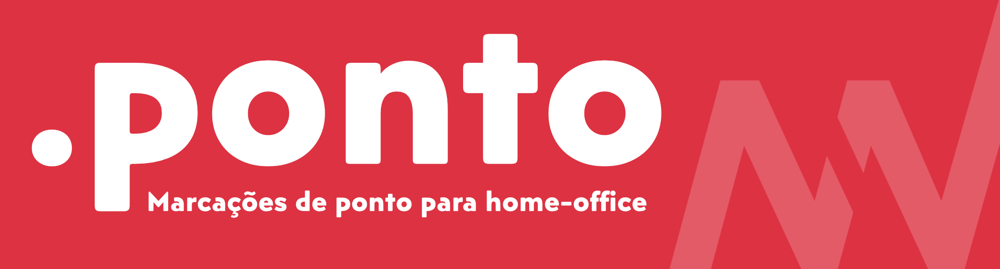
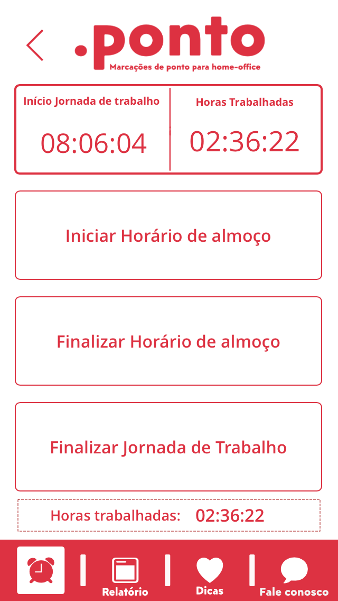
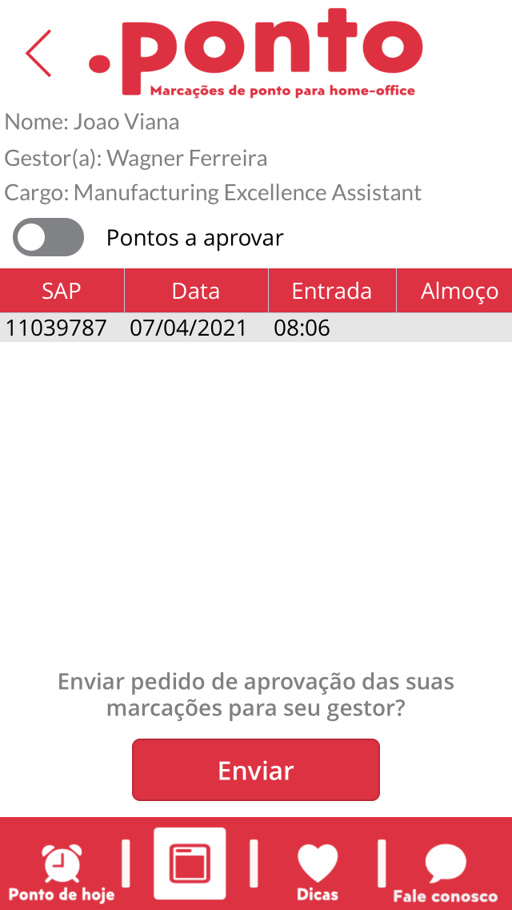
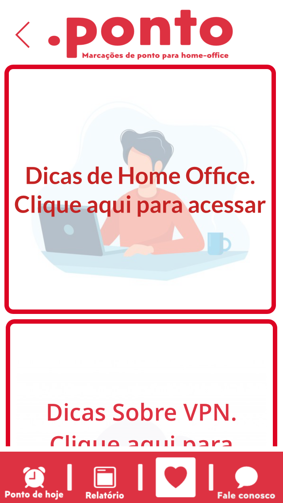
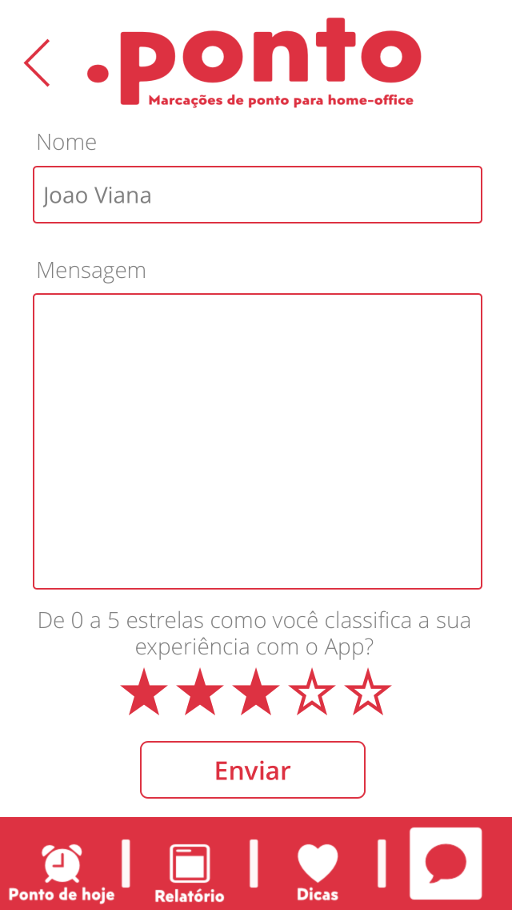

<h1 align="center">
    
</h1>

<h4 align="center"> 
	Status: Implementado! ✅
</h4>

 <a href="#-sobre-o-projeto">Sobre</a> •
 <a href="#-funcionalidades">Funcionalidades</a> •
 <a href="#-layout">Layout</a> • 
 <a href="#-como-executar-o-projeto">Como executar</a> • 
 <a href="#-tecnologias">Tecnologias</a> • 
 <a href="#-autor">Autor</a> 

## 💻 Sobre o projeto

.ponto - é um aplicativo desenvolvido diante a necessidade de controlar as marcações de pontos em regime de home-Office.

Quando iniciei o Home Office em 2020 devido as ações de contingência do coronavírus, tinha muita dificuldade de organizar os horários de início, almoço e finalização da jornada de trabalho. Assim desenvolvi o .ponto que tem como objetivo principal documentar o horários dos colaboradores que estão em home-office.

Hoje o aplicativo é utilizado por toda a empresa que trabalho, somando assim, a agilidade de acesso do RH para obter as informações de marcação de pontos de todos os colaboradores.

O Aplicativo híbrido, é por onde os usuários efetuam as marcações, ao finalizar sua jornada, o usuário envia uma solicitação pelo App para seu gestor, afim de obter a aprovação deste, em relação aos seus horários. Após aprovado pelo gestor os horários do usuário fica disponível para o RH tratar.

Abaixo descrevo um pouco mais de como o App funciona e como o desenvolvi!

---

## ⚙️ Funcionalidades

- [x] Marcar horários da jornada:
  - [x] Efetuar marcações dos horários de trabalho.
  - [x] Editar esse horário em caso de erros.
  - [x] Enviar marcações para aprovação do Gestor.
  - [x] Acompanhar quantas horas de trabalho possuí no dia.

---

## 🎨 Layout

### Tela 01

  
  

### Tela 02

  
  

### Tela 03

  
  

### Tela 04

  
  

---

## 🚀 Como executar o projeto

Este projeto é desenvolvido via PowerApps, logo para executá-lo é necessário participar da organizacão (Minha atual empresa) e solicitar acesso para o desenvolvedor -> joaobonilha96@gmail.com

Lembrando que esse repositório tem como obetivo apenas demonstrar os projetos desenvolvidos para contrução do meu portifólio profissional, e não compartilhar as aplicações.

---

## 🛠 Tecnologias

As seguintes ferramentas foram usadas na construção do projeto:

#### **Aplicativos**  
-   **[Power Apps](https://powerapps.microsoft.com/pt-br/)**
-   **[Power Automate](https://flow.microsoft.com/pt-br/)**
-   **[SQL Server](https://www.microsoft.com/pt-br/sql-server/sql-server-downloads)**
-   **[Azure Database](https://azure.microsoft.com/pt-br/)**

---

## 🦸 Autor

<a>
 
  
 <b> João Bonilha Viana</b></a>
  

---

Feito com ❤️ por João Bonilha Viana 👨🏼‍💻 [Entre em contato!](https://www.linkedin.com/in/VianaJo1/)

---
